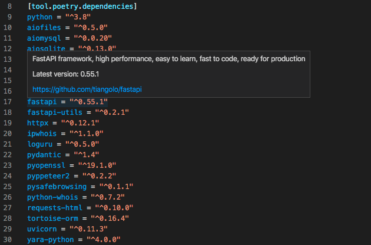
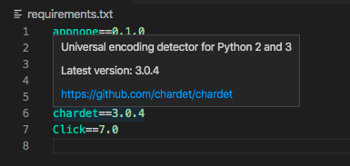

# vscode-pylens

A VS Code extension to show the latest version of a dependency in pyproject.toml (Poetry or Flit) or requirements.txt.

## TODO

- Implement features [Version Lens](https://marketplace.visualstudio.com/items?itemName=pflannery.vscode-versionlens) has.
